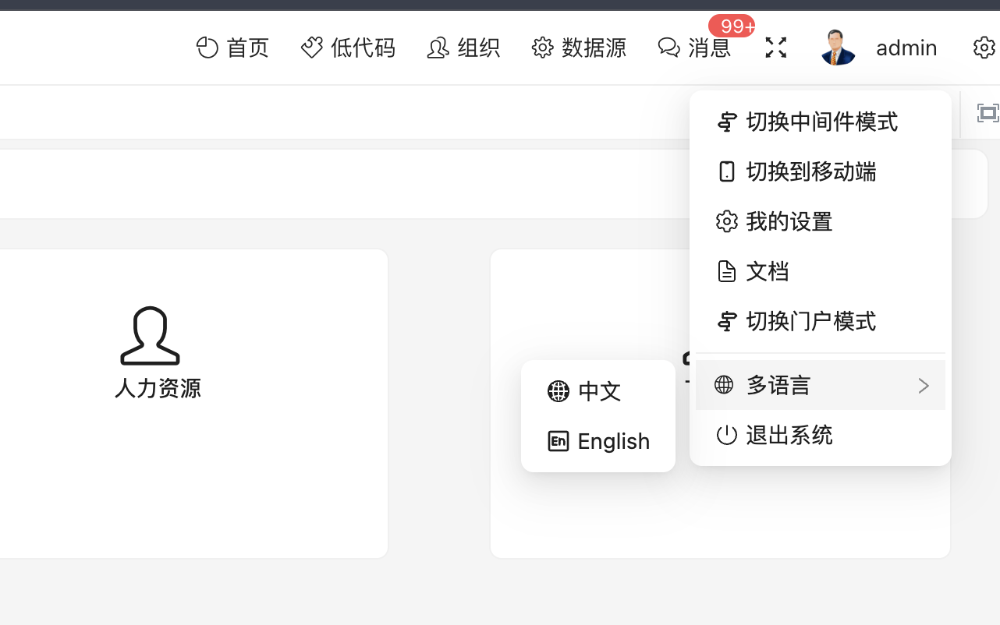
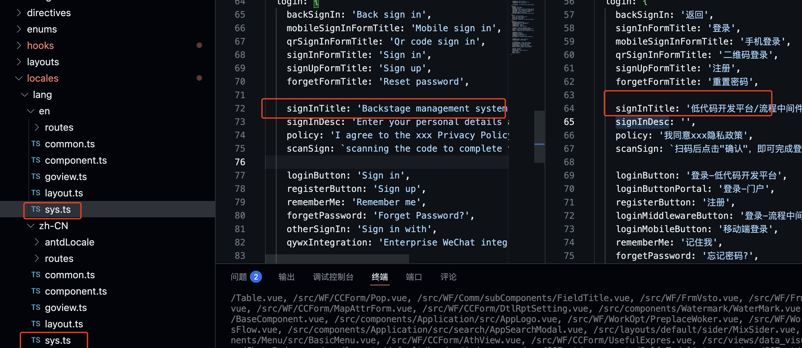

# 前端多语言配置步骤

## 前言

- vue3  多语言实现依赖i18n插件， 目前主要支持中文和英文配置。如需扩展可以参考/src/locales/lang下目录

### 多语言切换位置



### 如何添加多语言项

#### 前端实现多语言配置，只需要在locale下对应的不同语言文件夹添加相同的key即可

- 以Login.vue为例 {{ t('sys.login.signInDesc') }} 这个登录的描述，我们根据中文和  英文环境分别配置
- 中文的语言在 <span style="color:rgb(231, 125, 125)">/src/locales/lang/zh-CN/sys.ts</span>下
- 英文的语言在 <span style="color:rgb(231, 125, 125)">/src/locales/lang/en/sys.ts</span>下



### 如果在vue组件中使用i18n？

```typescript
  //  以Login.vue为例
  // 先引用函数 
  import { useI18n } from '/@/hooks/web/useI18n';
  // 在setup中通过函数导出t函数 
  const { t } = useI18n();
```

```html
  <!--在 模板中使用 -->
  <div class="mt-5 font-normal text-white text-md dark:text-gray-500 -enter-x">
    {{ t('sys.login.signInDesc') }}
  </div>
```
## 使用插件轻松提取key
### 使用ccbpm-i18n插件可以轻松提取所有文件中的中文为key, 并自动替换模版的中文为i18n函数，生成key为dir.file._key${idx}。

使用方式：
 1. 全局
 ```bash
    pnpm i18n:apply # 抽取key并生成
    pnpm i18n:extract # 测试，不生成和替换文件
 ```
 2.指定目录
 ```bash
    pnpm i18n:apply --dirs CCFast # 抽取CCFast中所有vue文件和ts文件并生成key
    pnpm i18n:extract --dirs CCFast # 测试CCFast目录提取，不生成和替换文件
    pnpm i18n:fix-enum filepath # filepath为文件路径
    pnpm i18n:revert-zh --dirs CCFast # 反向替换
 ```
