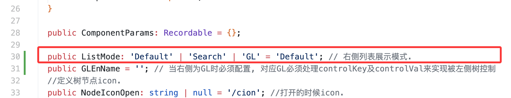
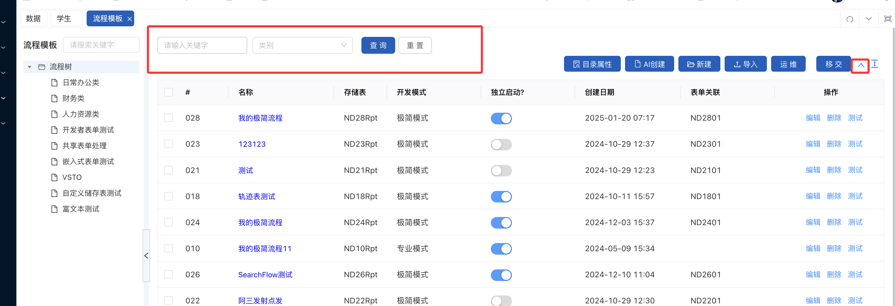
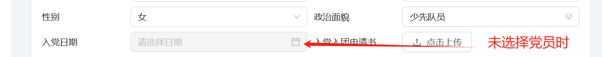
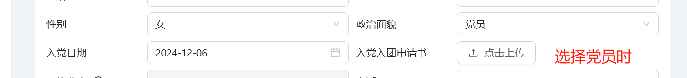
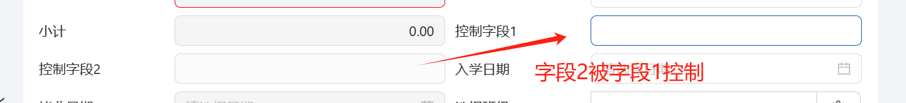
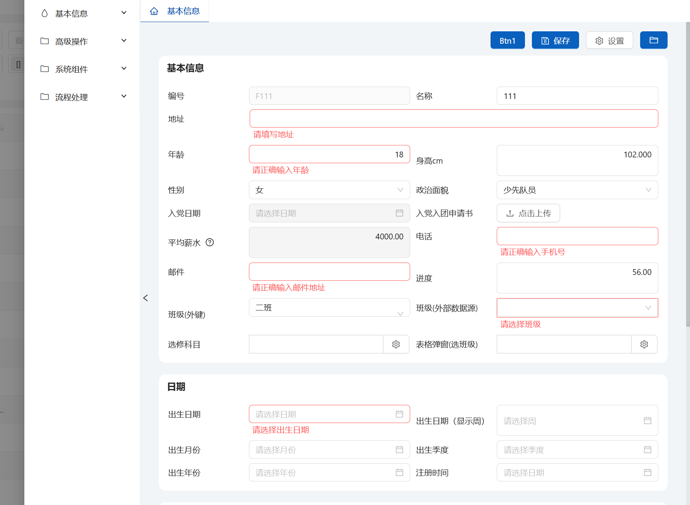
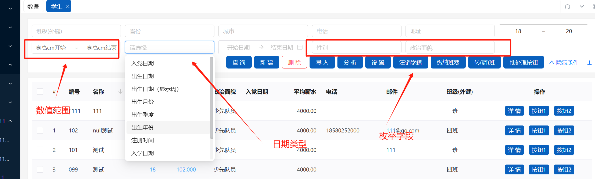

# 实体高级功能示例


- ## 【逻辑删除】25.02 更新

  实现逻辑删除需要重写默认的Entity配置
  如下是对简历实体（TS.Demo.Resume）进行逻辑删除配置

```typescript
  // 部分代码，完整请参考Resume.ts
export class Resume extends EntityMyPK {
  constructor(pkval?: string) {
    super('TS.Demo.Resume');
    if (!!pkval) this.setPKVal(pkval);
  }
  // 重写逻辑删除配置
  override get LogicDelConfig() {
    return {
      key: 'IsDelete',
      enable: true,
    };
  }
  // ...
}
```

- ## 【TreeEns模式扩展】25.02更新

  TreeEns支持右侧展示Search组件或者GL组件，默认模式也支持了查询条件



- ## 实现级联控制，字段间控制

- 例：当选择身份为党员时，才可选择入党日期

```typescript
    map.AddDDLSysEnum('ZZMM', 0, '政治面貌', true, true, 'ZZMM', '@0=少先队员@1=团员@2=党员@3=无党派人士@4=群众@5=WEIZHI');
    map.AddTBDate('JoinCCPDate', null, '入党日期', true, false, false, '', { type: 'date', format: 'YYYY-MM-DD' });
    // 演示选择政治面貌控制入党日期是否可填（函数）
    map.enMapExts.SetCascadeControl('ZZMM', 'JoinCCPDate', (val): boolean => {
      return val == 2; // 当政治面貌选择为党员时，才可以选择入党日期
    });
```




- 例：当字段1填写，才可以填写字段2

```typescript
    map.AddTBString('Control1', null, '控制字段1', true, false, 0, 200, 100);
    map.AddTBString('Control2', null, '控制字段2', true, false, 0, 200, 100);
    // 当第一个字段被填写后，第二个字段才可填写. @Wanglu, 描述好场景.
    map.enMapExts.SetCascadeControl('Control1', 'Control2');
```



- 例如: 限制日期a不能超过b

```typescript
    // 入学日期不能超过毕业日期
    map.AddTBDate('EnrollmentDate', null, '入学日期', true, false, false, '', { type: 'date', format: 'YYYY-MM-DD HH:mm' });
    map.AddTBDate('GraduationDate', null, '毕业日期', true, false, false, '', { type: 'date', format: 'YYYY-MM-DD HH:mm' });
    // 设置日期范围，当开始日期选中后，结束日期才可以选择
    // 并且结束日期不会先于开始日期,比如请假日期从，到
    map.enMapExts.SetDateRange('EnrollmentDate', 'GraduationDate');
```

- ### 字段校验

#### <span style="color:#ff5555">需要ant-design-vue > 4.2.5 版本</span>

```typescript
    // 字段校验，多次调用AddRules最后会合并
    // 规则参考ant-design-vue
    map.AddRules({
      Age: [
        {
          validator(_rule, value, callback) {
            if (value > 15 || value < 5) {
              callback('请正确输入年龄');
            } else {
              callback();
            }
          },
        },
      ],
      Addr: [
        {
          required: true,
          message: '请填写地址',
        },
      ],
      Tel: [
        {
          validator(_rule, value, callback) {
            callback(/^1[3-9]\d{9}$/.test(value) ? undefined : '请正确输入手机号');
          },
        },
      ],
      Email: [
        {
          validator(rule, value, callback) {
            const emailRegex = /^[a-zA-Z0-9._%+-]+@[a-zA-Z0-9.-]+\.[a-zA-Z]{2,}$/;
            // 如果自定义校验，callback必须调用
            callback(emailRegex.test(value) ? undefined : '请正确输入邮件地址');
          },
        },
      ],
    });
```



- ### 日期配置

```typescript
    // 支持多种类型的日期选择及格式
    map.AddGroupAttr('日期');
    map.AddTBDate('BirthDT', null, '出生日期', true, false, false, '', { type: 'date', format: 'YYYYMM' });
    map.AddTBDate('BirthWeek', null, '出生日期（显示周）', true, false, false, '', { type: 'week', format: 'YYYY.MM.DD' });
    map.AddTBDate('BirthMonth', null, '出生月份', true, false, false, '', { type: 'month', format: 'YYYYMM' });
    map.AddTBDate('BirthQuarter', null, '出生季度', true, false, false, '', { type: 'quarter', format: 'YYYY-MM-DD' });
    map.AddTBDate('BirthYear', null, '出生年份', true, false, false, '', { type: 'year', format: 'YYYY' });
    map.AddTBDateTime('RegDate', null, '注册时间', true, false, false, '', { type: 'datetime', format: 'YYYY-MM-DD HH:mm', showTime: true });
```

- ### 查询配置（适用于Search组件）

- 添加查询条件

```typescript
    //查询条件:枚举或者外键
    map.AddSearchAttr('BanJiNo'); //班级.
    map.AddSearchAttr('XB'); // int类型的枚举.
    map.AddSearchAttr('ZZMM'); //string类型的枚举值.
    map.AddSearchAttr('ShengFen'); // 省份.
    map.AddSearchAttr('City'); // 城市.
    map.DTSearchLabel = '日期';
    map.DTSearchWay = DTSearchWay.ByDate;
    //普通的.
    map.AddSearchField('Tel');
    map.AddSearchField('Addr');

    // 数值字段.
    map.AddSearchAttr('Age');
    map.AddSearchAttr('SG');
```

- <span style="color:red">如果需要url固定参数, 需要以s_key_开头，比如你配置了一个Name查询字段，那么当需要固定查询条件时，需要加的参数为
s_key_Name=xxx</span>



- 添加合计列

```typescript
    // 添加合计列，Search页面生效
    map.ShowSummary = true;
    map.enMapExts.AddSummaryColumns('HJ');
    map.enMapExts.AddSummaryColumns('DanJia');
    map.enMapExts.AddSummaryColumns('ShuiLiang');
```

- ### 为实体添加功能（方法）

```typescript
    // 添加分组
    map.AddGroupMethod('高级操作');
    const rm = new RefMethod();
    rm.Title = '注销学籍';
    // 重要！这里对应的是类中的方法名
    rm.ClassMethod = 'ZhuXiaoXueJi'; 
    rm.RefMethodType = RefMethodType.Func;
    rm.Warning = '您确定要执行吗？';
    rm.IsCanBatch = true; //是否允许批处理，在Search.vue组件里.
    rm.IsForEns = false;
    map.AddRefMethod(rm);

    const rm2 = new RefMethod();
    rm2.Title = '缴纳班费';
    rm2.ClassMethod = 'JNBanFei';
    rm2.HisMap.AddTBString('note', null, '缴纳备注', true, false, 0, 100, 1000, true);
    rm2.HisMap.AddTBDecimal('jine', 0, '金额', true, false, true);
    rm2.IsCanBatch = true;
    map.AddRefMethod(rm2);

    const rm3 = new RefMethod();
    rm3.Title = '转(调)班';
    rm3.ClassMethod = 'Turn2BanJi';
    rm3.HisMap.AddTBString('BanJINo', null, '选择班级(输入)', true, false, 0, 100, 1000, true);
    //参数需要弹窗显示的解析
    rm3.HisMap.AddTBString('Addr', null, '地址(只读)', true, true, 0, 100, 1000, true);
    rm3.HisMap.AddTBString('Tel', null, '电话(不可见)', false, false, 0, 100, 1000, true);
    rm3.HisMap.AddTBString('BanJiPop', null, '选择班级(弹窗)', true, false, 0, 100, 1000, true);
    rm3.HisMap.AddTBString('EmpNo', null, '选人', true, true, 0, 100, 1000, true);
    rm3.HisMap.SetPopTreeEns(
      'EmpNo',
      GloWF.srcDeptLazily,
      GloWF.srcDeptRoot,
      `SELECT No,Name FROM Port_Emp where FK_Dept='@Key' `,
      'No',
      false,
      '800px',
      '600px',
      '选择人员',
      'icon-people',
    );
    rm3.IsCanBatch = true;
    map.AddRefMethod(rm3);

    //增加列表.
    map.AddRM_GL(new GL_Todolist(), 'GL列表', 'icon-drop', '&FlowNo=001');
    //打印rtf,生成doc格式的文件.
    map.AddRM_PrintRTF('打印', 'StudentDemo.rtf', 'doc');
 ```

- 部分方法对应代码如下

```typescript
  public async ZhuXiaoXueJi(): Promise<string> {
    // const url = '';
    // return new GPNReturnObj(GPNReturnType.GoToUrl, url);
    // return '执行成功';
    // alert('ssdsds');
    const handler = new HttpHandler('BP.App.Handler_Demo');
    handler.AddPara('No', this.No);
    handler.AddPara('Name', this.Name);
    // handler.AddFile
    return await handler.DoMethodReturnString('Student_ZhuXiaoXueJi');
  }
```


