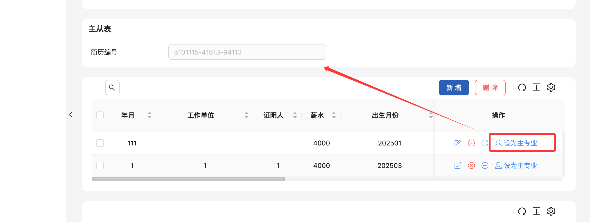

# 实体扩展（外挂）功能示例

## 实现字表动态修改主表数据

- 例：学生从字表简历列表中，选择一个简历作为主表的展示简历

```typescript
  // WGEntity_Resume.ts (扩展类)
  import { WaiGuaBaseEntity } from '/@/bp/UIEntity/WaiGuaBaseEntity';
  export class WGEntity_Resume extends WaiGuaBaseEntity {
    constructor() {
      super('WGEntity_Resume', 'TS.Demo.Resume');
      this.RowFunctions = [
        {
          label: '设为主专业',
          icon: 'icon-user',
          onClick: async (rowData, mainTableClassId, mainTableRow) => {
            // mainTableRow修改后需返回主表数据
            mainTableRow['ResumeNo'] = rowData.MyPK;
            return {
              mainTableRow,
            };
          },
        },
      ];
    }
    public override async BtnClick(_srcEvent: string, _btnLab: string, _selectedRowIDs = '', _row) {
    }
  }

```

