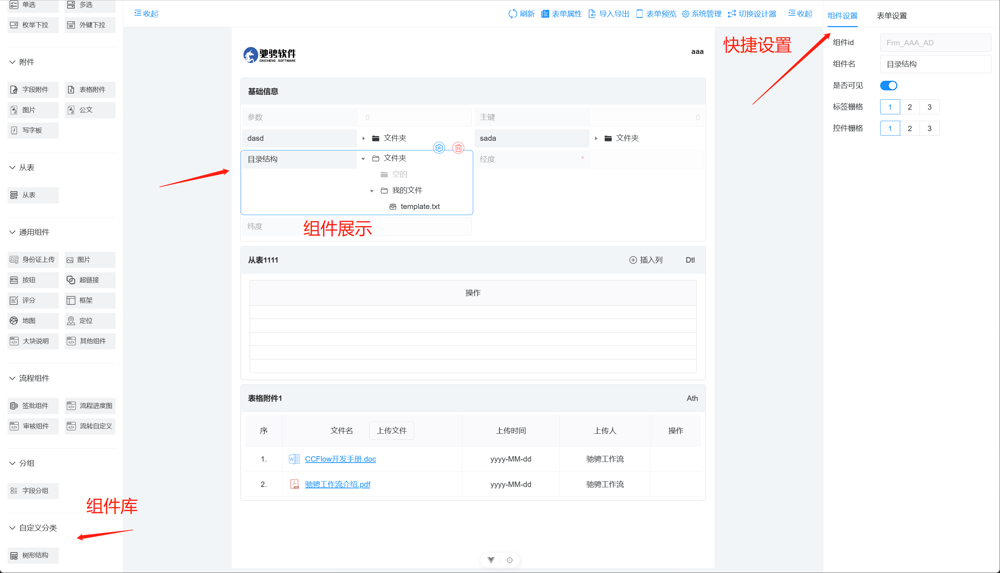

# 新建自定义控件详细操作如下：


#### 如果需要完整的从头开始定义一个全新的组件，需要经过以下步骤

1. 左侧组件库中对这个组件的定义 (定义在/props/form/FormComponents.ts下，包含key,icon等)
2. 定义组建的参数配置，用户前后端数据同步（定义在/props/widgets/控件分类/控件.ts文件）
3. 组件在设计器中的渲染 (定义在/components/widgets/控件分类/控件.vue文件)
4. 组件的快捷设置 (定义在/components/settings/widgets/控件分类/控件.vue文件)
5. 扩充/props/database/DatabaseFormItem.ts中DBEnums类型
6. 组件的创建方法 (定义在/props/type-utils/CreateFunctions.ts文件) 
7. 组件和创建方法映射 (定义在/props/type-map/FormTypeMap.ts文件)
8. 组件高级设置对应的完整实体类(一般自定义字段类控件都是TS.Sys.MapAttr，如果需要完全自定义可在/WF/Admin/FrmLogic相应位置配置)


### 完整示例
例如需要我们需要新增一个自定义分类，这个分类下需要添加一个树结构的组件，步骤如下, 包含完整代码
1. 在/props/form/FormComponents.ts中 defineComponents末尾添加如下配置
```typescript
  {
    title: '自定义分类',
    key: 'customize',             // 注意大小写
    icon: 'iconfont icon-fenzu',
    children: [
      {
        title: '树形结构',
        key: 'tree',
        category: 'Customize',    // 注意大小写
        visible: true,
        icon: 'iconfont icon-organization',
      }, 
    ],
  }
```
2. 在/props/widgets/下新建目录customize, 并在目录下新建CustomizeTree.ts文件
- 文件内容如下：
```typescript
import { FormItem } from '../../form/FormComponents';

// 输入类单元格额外属性
export interface CustomizeTree extends FormItem {
  clearable: boolean; // 显示清除按钮
  readonly: boolean; // 是否只读
  placeholder: string; // 占位符提示
  modelVal: '';
  data: [];
}

// 额外属性
const props: Partial<CustomizeTree> = {
  clearable: false,
  readonly: false,
  placeholder: '',
  modelVal: '',
  data: [],
};

export default props;
/** 
 * 这里定义的属性主要是方便组件内类型推断
 */
```
- 在/props/widgets/index.ts 文件添加以下代码
```typescript
// 自定义组件
export { default as Customize_tree_Props } from './customize/CustomizeTree';  // 切记大小写，分类大写，类型小写
```
3. 在/components/widgets/下新建目录customize-components， 并在customize下新建tree.vue组件 
tree.vue 内容如下:
```vue
<script lang="ts">
import { h, PropType, defineComponent } from 'vue';
import { Folder, FolderOpenOutline, FileTrayFullOutline } from '@vicons/ionicons5';
import { NIcon, NFormItem, NTree, TreeOption } from 'naive-ui';
import SelectHelper from '/@form/components/helper/SelectHelper.vue';
import { message } from 'ant-design-vue';
import { UniversalFieldItemProps } from '/@form/props/widgets/universal/UniversalNormalWidget';

export default defineComponent({
  name: 'CustomizeTree',
  components: {
    SelectHelper,
    NFormItem,
    NTree,
  },
  props: {
    widgetInfo: {
      /** 上方定义的类型和属性用在这里方便类型推断 */
      type: Object as PropType<UniversalFieldItemProps>,  
      default: () => {},
    },
  },
  setup(props) {
    const data = [
      {
        key: '文件夹',
        label: '文件夹',
        prefix: () =>
          h(NIcon, null, {
            default: () => h(Folder),
          }),
        children: [
          {
            key: '空的',
            label: '空的',
            disabled: true,
            prefix: () =>
              h(NIcon, null, {
                default: () => h(Folder),
              }),
          },
          {
            key: '我的文件',
            label: '我的文件',
            prefix: () =>
              h(NIcon, null, {
                default: () => h(Folder),
              }),
            children: [
              {
                label: 'template.txt',
                key: 'template.txt',
                prefix: () =>
                  h(NIcon, null, {
                    default: () => h(FileTrayFullOutline),
                  }),
              },
            ],
          },
        ],
      },
    ];
    const updatePrefixWithExpanded = (
      _keys: Array<string | number>,
      _option: Array<TreeOption | null>,
      meta: {
        node: TreeOption | null;
        action: 'expand' | 'collapse' | 'filter';
      },
    ) => {
      if (!meta.node) return;
      switch (meta.action) {
        case 'expand':
          meta.node.prefix = () =>
            h(NIcon, null, {
              default: () => h(FolderOpenOutline),
            });
          break;
        case 'collapse':
          meta.node.prefix = () =>
            h(NIcon, null, {
              default: () => h(Folder),
            });
          break;
      }
    };
    const nodeProps = ({ option }: { option: TreeOption }) => {
      return {
        onClick() {
          if (!option.children && !option.disabled) {
            message.info('[Click] ' + option.label);
          }
        },
      };
    };
    return {
      updatePrefixWithExpanded,
      nodeProps,
      data,
      settingUrl: `../../Comm/EnOnly.htm?EnName=TS.FrmUI.FrmBtn&PKVal=${props.widgetInfo?.id}&s=${Math.random()}`,
    };
  },
});
</script>

<template>
  <select-helper :widget="widgetInfo" :setting-url="settingUrl">
    <n-form-item :label="widgetInfo.title" :show-feedback="false">
      <n-tree block-line expand-on-click :data="data" :node-props="nodeProps" :on-update:expanded-keys="updatePrefixWithExpanded" />
    </n-form-item>
  </select-helper>
</template>
```

4. 在/components/settings/widgets/添加目录 customize-widgets ,并添加Index.vue 以及 Tree.vue
- Index.vue
```vue
<script lang="ts">
import { useDesignerStore } from '/@/store/modules/form';

import Tree from './Tree.vue';

import { h, defineComponent } from 'vue';
const store = useDesignerStore();

const DynamicInputSettings = new Map<string, any>([
  ['tree', Tree],  // 多个组件这里配置
]);

export default defineComponent({
  name: 'CustomizeOptions',  // 这里必须按照规则配置名称，否则无法注入 -> 大类名 + Options
  setup() {
    return () => h(DynamicInputSettings.get(store.selectedWidget?.key + ''));
  },
});
</script>
```

- Tree.vue
```vue
<template>
  <BaseOptions>
    <n-form-item label="组件ID" :show-feedback="false">
      <n-input v-model:value="selectedWidget.id" :disabled="true" />
    </n-form-item>

    <n-form-item label="组件名" :show-feedback="false">
      <n-input v-model:value="selectedWidget.title" maxlength="40" @update-value="updateConfigToDatabase(selectedWidget.key !== 'iframe' ? 'Name' : 'Lab', $event, false)" />
    </n-form-item>
    <n-form-item label="是否可见" :show-feedback="false">
      <n-switch v-model:value="selectedWidget.visible" size="small" @update-value="updateConfigToDatabase('UIVisible', $event ? 1 : 0, true)" />
    </n-form-item>
    <template v-if="selectedWidget.key !== 'iframe'">
      <n-form-item label="标签栅格" :show-feedback="false">
        <n-radio-group
          v-model:value="selectedWidget.labelSpan"
          size="small"
          :theme-overrides="RadioGroupTheme"
          @update-value="updateConfigToDatabase('LabelColSpan', $event, false)"
        >
          <n-radio-button :value="1">1</n-radio-button>
          <n-radio-button :value="2" :disabled="selectedWidget.inputSpan + 2 > cols">2</n-radio-button>
          <n-radio-button :value="3" :disabled="selectedWidget.inputSpan + 3 > cols">3</n-radio-button>
        </n-radio-group>
      </n-form-item>
      <n-form-item label="控件栅格" :show-feedback="false">
        <n-radio-group v-model:value="selectedWidget.inputSpan" size="small" :theme-overrides="RadioGroupTheme" @update-value="updateConfigToDatabase('ColSpan', $event, false)">
          <n-radio-button :value="1">1</n-radio-button>
          <n-radio-button :value="2" :disabled="selectedWidget.labelSpan + 2 > cols">2</n-radio-button>
          <n-radio-button :value="3" :disabled="selectedWidget.labelSpan + 3 > cols">3</n-radio-button>
        </n-radio-group>
      </n-form-item>
    </template>
  </BaseOptions>
</template>

<script lang="ts" setup>
import { useDesignerStore } from '/@/store/modules/form';
import { computed } from 'vue';
import { NInput, NFormItem, NRadioGroup, NRadioButton, NSwitch } from 'naive-ui';
import BaseOptions from '/@form/components/settings/widgets/BaseOptions.vue';
import { RadioGroupTheme } from '/@form/theme/index';

const store = useDesignerStore();
const selectedWidget: any = computed(() => store.selectedWidget);

const cols = computed(() => store.globalFormConfig.cols);

const updateConfigToDatabase = (key: string, val: any, isExtraPara: boolean) => {
  const { selectedWidgetDto } = store;
  if (isExtraPara) {
    selectedWidgetDto?.setPara(key, val);
  } else {
    selectedWidgetDto?.setVal(key, val);
  }
  selectedWidgetDto?.Update();
};
</script>

<style lang="less" scoped>
.input-options {
  width: 100%;
  height: 100%;

  &:deep(.n-form-item .n-form-item-blank) {
    padding-left: 8px;
    padding-right: 8px;
  }
}
</style>
```

5. 在/props/database/DatabaseFormItem.ts -> export enum DBEnums末尾添加
```typescript
  // 自定义树组件
  CustomizeTree = 105
```
6. 在/props/type-utils/CreateFieldFunction.ts添加创建此组件的方法
```typescript
export async function createCustomizeTree(target: FormItem, formId: string, index: number) {
  const field = await createBaseControlField(target, formId, index);
  if (!field) return null;
  const attr = field?.getData();
  attr.UIContralType = DBEnums.CustomizeTree;
  attr.MyPK = `${formId}_${attr.KeyOfEn}`;
  await field.Insert();
  return field;
}
```
备注：如果是分组控件则扩展同目录下 CreateContainerFunction.ts 

7. 在/props/type-map/FormTypeMap.ts创建关联
```typescript
// 导入创建方法
import {
  // ...
  createCustomizeTree, // 添加自定义控件的创建方法
} from '../type-utils/CreateFieldFunctions';


// 关联方法
const CreateFieldFunctions = new Map<string, Function>([
  // ...
  ['customize-tree', createCustomizeTree], // 关联方法
])

// 关联数据库类型和前端类型
const FieldType = new Map<number, any>([
  // ...
  [DBEnums.CustomizeTree, { key: 'tree', category: 'Customize' }], // 把这个控件的前后端数据类型关联
]); 
```

备注：如果是分组控件则扩展 CreateGroupFunctions 及 GroupType

8. 如果需要这个高级控件需要对设置项单独控制，可以单独写一个TS文件，在/WF/Admin/FrmLogic下，例如新建一个MapAttrTree.ts
```typescript
import { UAC } from '/@/bp/en/Map/UAC';
import { Map } from '/@/bp/en/Map/Map';
import { EntitiesMyPK, EntityMyPK } from '/@/bp/en/EntityMyPK';
import { DataType } from '/@/bp/en/DataType';
import Events from '/@/utils/Events';
/**
 * 字段属性
 */
export class MapAttrAttr {
  /// 表单ID
  public static readonly FK_MapData = 'FK_MapData';
  /// 属性
  public static readonly KeyOfEn = 'KeyOfEn';
  /// 描述
  public static readonly Name = 'Name';
  public static readonly DefVal = 'DefVal';
  public static readonly DefValType = 'DefValType';
  public static readonly UIContralType = 'UIContralType';
  public static readonly MyDataType = 'MyDataType';
  public static readonly LGType = 'LGType';
  public static readonly UIWidth = 'UIWidth';
  public static readonly UIHeight = 'UIHeight';
  public static readonly MinLen = 'MinLen';
  public static readonly MaxLen = 'MaxLen';
  public static readonly UIBindKey = 'UIBindKey';
  public static readonly UIRefKey = 'UIRefKey';
  public static readonly UIRefKeyText = 'UIRefKeyText';
  public static readonly ExtIsSum = 'ExtIsSum';
  public static readonly UIVisible = 'UIVisible';
  public static readonly UIIsEnable = 'UIIsEnable';
  public static readonly UIIsLine = 'UIIsLine';
  public static readonly UIIsInput = 'UIIsInput';
  public static readonly IsSupperText = 'IsSupperText';
  public static readonly FontSize = 'FontSize';
  public static readonly IsSigan = 'IsSigan';
  public static readonly GUID = 'GUID';
  public static readonly EditType = 'EditType';
  public static readonly Tag = 'Tag';
  public static readonly Tag1 = 'Tag1';
  public static readonly Tag2 = 'Tag2';
  public static readonly Tag3 = 'Tag3';
  public static readonly Tip = 'Tip';
  public static readonly ColSpan = 'ColSpan';
  public static readonly LabelColSpan = 'LabelColSpan';
  public static readonly RowSpan = 'RowSpan';
  public static readonly GroupID = 'GroupID';
  public static readonly IsEnableInAPP = 'IsEnableInAPP';
  public static readonly CSSCtrl = 'CSSCtrl';
  public static readonly CSSLabel = 'CSSLabel';
  public static readonly Idx = 'Idx';
  public static readonly ICON = 'ICON';
  public static readonly TextModel = 'TextModel';
}

/// <summary>
/// 字段属性
/// </summary>
export class MapAttrTree extends EntityMyPK {
  /// 是否是数字.
  get IsNum() {
    return this.MyDataType == DataType.AppInt || this.MyDataType == DataType.AppDouble || this.MyDataType == DataType.AppFloat || this.MyDataType == DataType.AppFloat;
  }

  constructor(mypk?: string) {
    super('TS.Sys.MapAttrTree', 'BP.Sys.MapAttr');
    if (!!mypk) this.MyPK = mypk;
  }

  /// <summary>
  /// 实体的权限控制
  /// </summary>
  public override get HisUAC() {
    const uac = new UAC();
    uac.IsDelete = true;
    uac.IsUpdate = true;
    uac.IsInsert = true;
    return uac;
  }
  public static SQLOfGroupAttr = "SELECT OID as No, Lab as Name FROM Sys_GroupField WHERE FrmID='@FK_MapData' AND (CtrlType IS NULL OR CtrlType='') ";

  public override get EnMap() {
    // if (this._enMap != null)
    //   return this._enMap;
    const map = new Map('Sys_MapAttr', '字段属性');

    map.AddMyPK();

    map.AddTBString(MapAttrAttr.FK_MapData, null, '表单ID', true, true, 1, 100, 20);
    map.AddTBString(MapAttrAttr.KeyOfEn, null, '属性', true, true, 1, 200, 20);

    map.AddTBString(MapAttrAttr.Name, null, '描述', true, false, 0, 200, 20);
    map.AddTBString(MapAttrAttr.DefVal, null, '默认值', false, false, 0, 400, 20);
    map.AddTBInt(MapAttrAttr.DefValType, 1, '默认值类型', true, false);

    map.AddTBInt(MapAttrAttr.UIContralType, 0, '控件', true, false);
    map.AddTBInt(MapAttrAttr.MyDataType, 1, '数据类型', true, false);

    map.AddDDLSysEnum(MapAttrAttr.LGType, 0, '逻辑类型', true, false, MapAttrAttr.LGType, '@0=普通@1=枚举@2=外键@3=打开系统页面');

    map.AddTBFloat(MapAttrAttr.UIWidth, 100, '宽度', true, false);
    map.AddTBFloat(MapAttrAttr.UIHeight, 23, '高度', true, false);

    map.AddTBInt(MapAttrAttr.MinLen, 0, '最小长度', true, false);
    map.AddTBInt(MapAttrAttr.MaxLen, 300, '最大长度', true, false);

    map.AddTBString(MapAttrAttr.UIBindKey, null, '绑定的信息', true, false, 0, 100, 20);
    map.AddTBString(MapAttrAttr.UIRefKey, null, '绑定的Key', true, false, 0, 30, 20);
    map.AddTBString(MapAttrAttr.UIRefKeyText, null, '绑定的Text', true, false, 0, 30, 20);

    map.AddTBInt(MapAttrAttr.ExtIsSum, 0, '是否显示合计(对从表有效)', true, true);
    map.AddTBInt(MapAttrAttr.UIVisible, 1, '是否可见', true, true);
    map.AddTBInt(MapAttrAttr.UIIsEnable, 1, '是否启用', true, true);
    map.AddTBInt(MapAttrAttr.UIIsLine, 0, '是否单独栏显示', true, true);
    map.AddTBInt(MapAttrAttr.UIIsInput, 0, '是否必填字段', true, true);
    //map.AddTBInt(MapAttrAttr.IsSecret, 0, '是否保密', true, true);
    //map.AddTBInt(MapAttrAttr.IsRichText, 0, '富文本', true, true);
    //@0=普通文本@1=密码框@2=大文本@3=富文本
    map.AddTBInt(MapAttrAttr.TextModel, 0, '文本类型', true, true);
    map.AddTBInt(MapAttrAttr.IsSupperText, 0, '是否是大文本', true, true);
    map.AddTBInt(MapAttrAttr.FontSize, 0, '字体大小', true, true);

    // 是否是签字，操作员字段有效。2010-09-23 增加。 @0=无@1=图片签名@2=CA签名.
    map.AddTBInt(MapAttrAttr.IsSigan, 0, '签字？', true, false);
    map.AddTBString(MapAttrAttr.GUID, null, 'GUID', true, false, 0, 128, 20);
    map.AddTBInt(MapAttrAttr.EditType, 0, '编辑类型', true, false);
    map.AddTBString(MapAttrAttr.Tag, null, '标识', true, false, 0, 100, 20);
    map.AddTBString(MapAttrAttr.Tag1, null, '标识1', true, false, 0, 100, 20);
    map.AddTBString(MapAttrAttr.Tag2, null, '标识2', true, false, 0, 100, 20);
    map.AddTBString(MapAttrAttr.Tag3, null, '标识3', true, false, 0, 100, 20);
    map.AddTBString(MapAttrAttr.Tip, null, '激活提示', false, true, 0, 200, 20);

    //单元格数量。2013-07-24 增加。
    //  map.AddTBString(MapAttrAttr.ColSpan, "1", "单元格数量", true, false, 0, 3, 3);
    map.AddTBInt(MapAttrAttr.ColSpan, 1, '单元格数量', true, false);
    //文本占单元格数量
    map.AddTBInt(MapAttrAttr.LabelColSpan, 1, '文本单元格数量', true, false);
    //文本跨行
    map.AddTBInt(MapAttrAttr.RowSpan, 1, '行数', true, false);
    //显示的分组.
    map.AddTBString(MapAttrAttr.GroupID, null, '显示的分组', false, true, 0, 20, 20);
    map.AddBoolean(MapAttrAttr.IsEnableInAPP, true, '是否在移动端中显示', true, true);

    // xxx 新增的样式.
    map.AddTBInt(MapAttrAttr.Idx, 0, '序号', true, false);
    map.AddTBString(MapAttrAttr.ICON, '0', 'Icon', true, false, 0, 50, 20);
    map.ParaFields = '';

    //参数属性.
    map.AddTBAtParas(4000);

    this._enMap = map;
    return this._enMap;
  }

  public override async afterInsert() {
    Events.emit('insertField', Object.fromEntries(this.Row));
    return true;
  }
}

/**
 * 字段属性s
 */
export class MapAttrs extends EntitiesMyPK {
  get GetNewEntity(): EntityMyPK {
    return new MapAttr();
  }
  constructor() {
    super();
  }
}

```

- 如果自定义了高级设置属性，那么需要将刚刚定义的/components/widgets/customize-components/Tree.vue中的settingUrl中的EnName修改为上面定义的类名
```typescript
  constructor(mypk?: string) {
    super('TS.Sys.MapAttrTree', 'BP.Sys.MapAttr');  // 第一个参数为类名
    if (!!mypk) this.MyPK = mypk;
  }
```


9. 现在可以在表单中看到刚刚定义好的组件了。 V2版本正在研发中，将支持一个单文件但组件模式，敬请期待。
- 
- 
